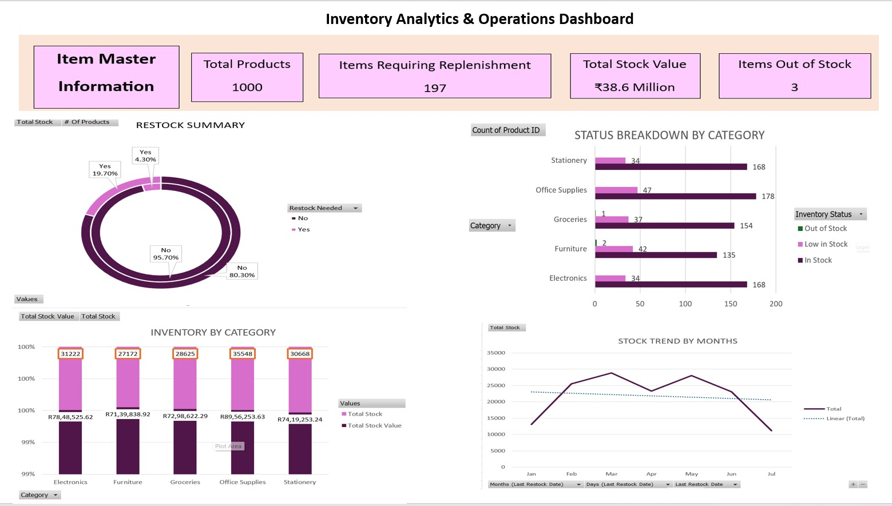

Inventory Analytics & Operations Dashboard

**An interactive, data-driven Excel dashboard designed to monitor stock performance, identify replenishment risks, and support operational decision-making.**

📸 *Dashboard Preview*

Executive snapshot of inventory health, restocking alerts, and category-level performance.

📌 **Project Overview**

Efficient inventory management plays a critical role in supply chain and warehouse operations.
This project simulates a real-world inventory environment using synthetic data to demonstrate how raw stock data can be transformed into actionable business insights.

The Inventory Analytics & Operations Dashboard enables users to:

Track Stock Health: Instantly identify items that are low, out of stock, or sufficiently available.

Prioritize Replenishment: Flag items that require immediate restocking based on defined thresholds.

Monitor Capital Value: Analyze where inventory investment is concentrated across product categories.

Understand Trends: Visualize monthly stock movements to identify seasonal or operational patterns.

🎯**Key Performance Indicators (KPIs)**
| Metric                            | Value         | Description                     |
| --------------------------------- | ------------- | ------------------------------- |
| **Total Products**                | 1000          | Total items tracked             |
| **Items Requiring Replenishment** | 197           | Products below safety threshold |
| **Stockouts**                     | 3             | Items with zero available stock |
| **Total Stock Value**             | ₹38.6 Million | Capital locked in inventory     |

🛠️**Technical Implementation**

This dashboard was developed entirely using Microsoft Excel, focusing on data automation, visualization, and decision support.

**1. Data Logic & Automation**

Generated a synthetic inventory dataset to simulate real warehouse conditions.

Applied Excel formulas to automatically classify stock status:

*=IF([@Quantity] < [@Reorder_Level], "Yes", "No")

=IF([@Quantity]=0,"Out of Stock",IF([@Quantity]<[@Reorder_Level],"Low Stock","Available"))*

**2. Pivot Tables & Analytics**

Created pivot tables to summarize:

Stock by category

Stock status distribution

Monthly inventory trends

Grouped restock dates to analyze month-wise stock behavior.

**3. Dashboard & Interactivity**

Used Slicers for filtering by:

Product Category

Stock Status

Replenishment Requirement

Designed KPI cards for quick executive insights.

Built dynamic charts for trend and category analysis.

🔍**Key Insights**

Replenishment Risk: Nearly 20% of inventory is below reorder threshold.

Capital Concentration: Electronics and Stationery hold the highest inventory value.

Seasonal Trend: Stock levels fluctuate mid-year, indicating demand or supply variations.

